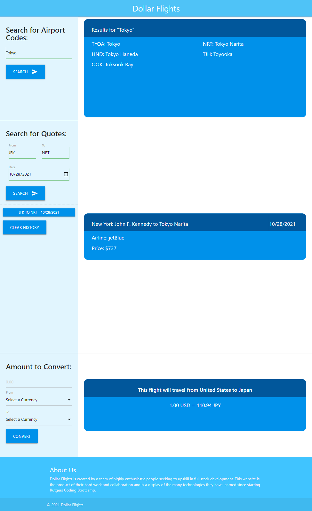

# Dollar Flights and Currency Exchange

## Description
This application allows users to search flight offers by inputting their city of origin, destination city and date of departure. In addition to getting an estimate for their fare, users will also be presented with the currency exchange rate between the two locations. Users will also be able to manipulate the currency exchange calculator.

## Usage
The homepage can be viewed via Github pages using the following link: [Dollar Flights](https://djamz919.github.io/ProjectOne/
)

If a user's search is domestic flight, they will be notified that their flight is domestic and will not require currency exchange. If a user's search is between two countries that have the same currency (e.g. countries in the european union), they will also be notified that no currency exchange will be required.

The user must input there specific airport codes to search for fares. If the user is unsure of the airport code. They are able to our search form that will return the airport codes associated with the city or country entered.

The applicaiton will also save user's searches in a search history so that they can easily retrieve previous searches.

## Technologies Used
* HTML
* CSS
* Javascript
* JQuery
* Materialize
* APIs used
    - Search Airport Codes & Search Flights: https://rapidapi.com/skyscanner/api/skyscanner-flight-search
    - Get Country Information: https://restcountries.com/v3.1/name/
    - Currency Exchange: https://cdn.jsdelivr.net/gh/fawazahmed0/currency-api@1/latest/currencies/eur.json

    

